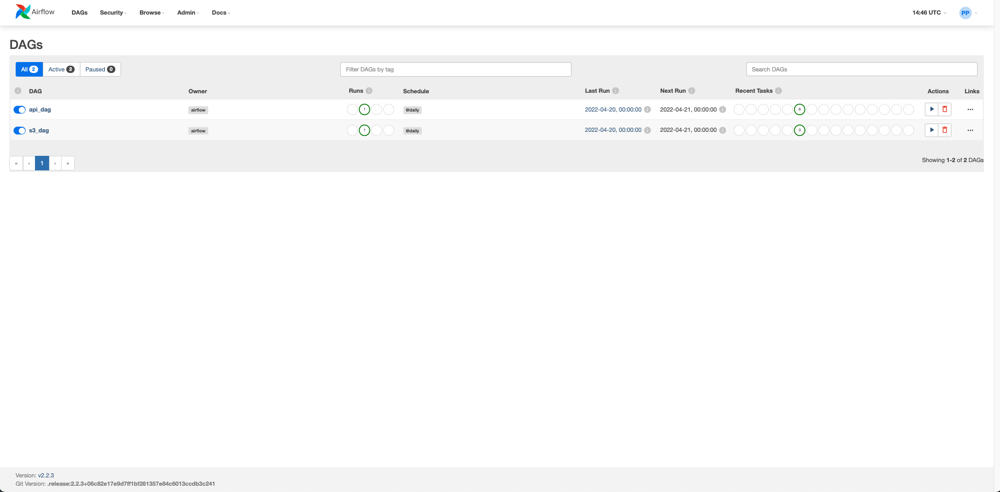
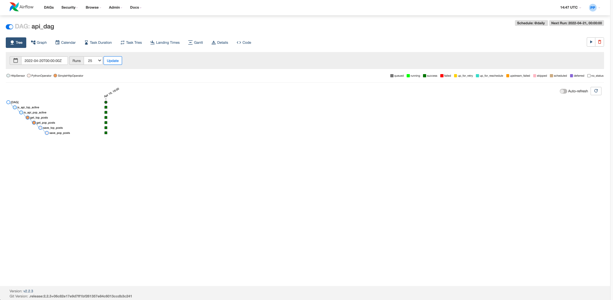
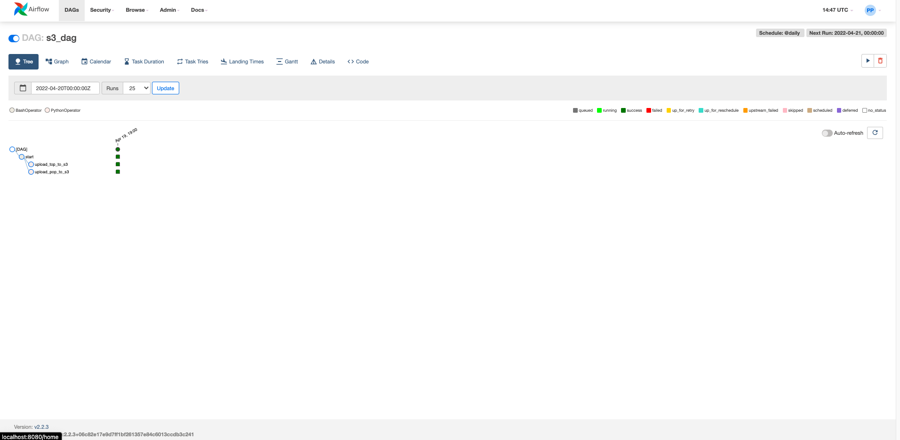
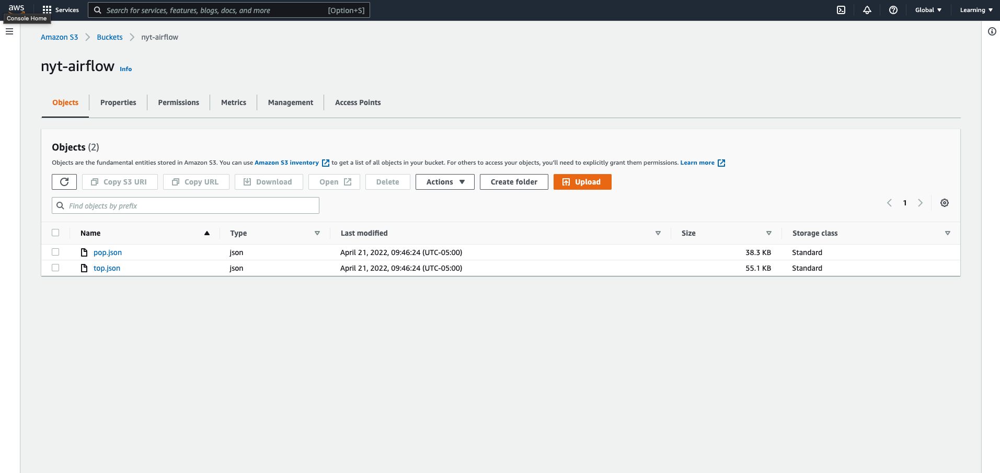

# New York Times Daily

An Airflow ETL pipeline that extracts data from NYT's API using Alirflow’s HTTP operators and sensors, then loads the data to an Amazon S3 bucket.

## Technologies Used

* Python
* Airflow
* AWS S3
* New Your Times API

## Screenshots

Airflow Home Page

API DAG

S3 DAG

AWS S3

## Future Enhancements

* Connect to a web application to present the data in the Amazon S3 bucket! 
